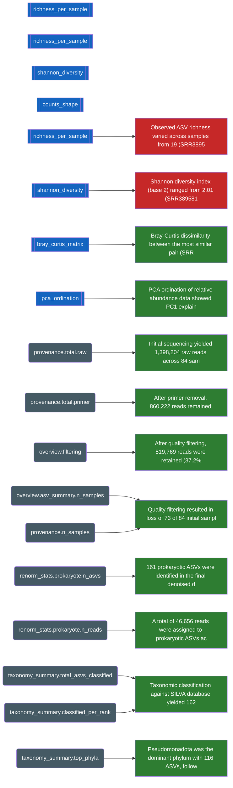

# Claim provenance DAG (qwen/qwen3.6-35b-a3b)

10/12 claims verified · 8 computations

Legend: 🟩 verified · 🟥 refuted · 🟨 unverifiable · 🟦 computation · ⬛ data

```mermaid
graph LR
  c1[["richness_per_sample"]]
  style c1 fill:#1565c0,color:#fff
  c2[["richness_per_sample"]]
  style c2 fill:#1565c0,color:#fff
  c3[["shannon_diversity"]]
  style c3 fill:#1565c0,color:#fff
  c4[["counts_shape"]]
  style c4 fill:#1565c0,color:#fff
  c5[["richness_per_sample"]]
  style c5 fill:#1565c0,color:#fff
  c6[["shannon_diversity"]]
  style c6 fill:#1565c0,color:#fff
  c7[["bray_curtis_matrix"]]
  style c7 fill:#1565c0,color:#fff
  c8[["pca_ordination"]]
  style c8 fill:#1565c0,color:#fff
  k1["Initial sequencing yielded 1,398,204 raw reads across 84 sam"]
  style k1 fill:#2e7d32,color:#fff
  provenance.total.raw("provenance.total.raw")
  style provenance.total.raw fill:#455a64,color:#fff
  k2["After primer removal, 860,222 reads remained."]
  style k2 fill:#2e7d32,color:#fff
  provenance.total.primer("provenance.total.primer")
  style provenance.total.primer fill:#455a64,color:#fff
  k3["After quality filtering, 519,769 reads were retained (37.2% "]
  style k3 fill:#2e7d32,color:#fff
  overview.filtering("overview.filtering")
  style overview.filtering fill:#455a64,color:#fff
  k4["Quality filtering resulted in loss of 73 of 84 initial sampl"]
  style k4 fill:#2e7d32,color:#fff
  overview.asv_summary.n_samples("overview.asv_summary.n_samples")
  style overview.asv_summary.n_samples fill:#455a64,color:#fff
  provenance.n_samples("provenance.n_samples")
  style provenance.n_samples fill:#455a64,color:#fff
  k5["161 prokaryotic ASVs were identified in the final denoised d"]
  style k5 fill:#2e7d32,color:#fff
  renorm_stats.prokaryote.n_asvs("renorm_stats.prokaryote.n_asvs")
  style renorm_stats.prokaryote.n_asvs fill:#455a64,color:#fff
  k6["A total of 46,656 reads were assigned to prokaryotic ASVs ac"]
  style k6 fill:#2e7d32,color:#fff
  renorm_stats.prokaryote.n_reads("renorm_stats.prokaryote.n_reads")
  style renorm_stats.prokaryote.n_reads fill:#455a64,color:#fff
  k7["Taxonomic classification against SILVA database yielded 162 "]
  style k7 fill:#2e7d32,color:#fff
  taxonomy_summary.total_asvs_classified("taxonomy_summary.total_asvs_classified")
  style taxonomy_summary.total_asvs_classified fill:#455a64,color:#fff
  taxonomy_summary.classified_per_rank("taxonomy_summary.classified_per_rank")
  style taxonomy_summary.classified_per_rank fill:#455a64,color:#fff
  k8["Pseudomonadota was the dominant phylum with 116 ASVs, follow"]
  style k8 fill:#2e7d32,color:#fff
  taxonomy_summary.top_phyla("taxonomy_summary.top_phyla")
  style taxonomy_summary.top_phyla fill:#455a64,color:#fff
  k9["Observed ASV richness varied across samples from 19 (SRR3895"]
  style k9 fill:#c62828,color:#fff
  k10["Shannon diversity index (base 2) ranged from 2.01 (SRR389581"]
  style k10 fill:#c62828,color:#fff
  k11["PCA ordination of relative abundance data showed PC1 explain"]
  style k11 fill:#2e7d32,color:#fff
  k12["Bray-Curtis dissimilarity between the most similar pair (SRR"]
  style k12 fill:#2e7d32,color:#fff
  provenance.total.raw --> k1
  provenance.total.primer --> k2
  overview.filtering --> k3
  overview.asv_summary.n_samples --> k4
  provenance.n_samples --> k4
  renorm_stats.prokaryote.n_asvs --> k5
  renorm_stats.prokaryote.n_reads --> k6
  taxonomy_summary.total_asvs_classified --> k7
  taxonomy_summary.classified_per_rank --> k7
  taxonomy_summary.top_phyla --> k8
  c5 --> k9
  c6 --> k10
  c8 --> k11
  c7 --> k12
```
