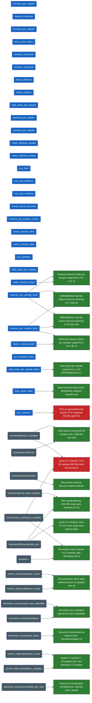

# Claim provenance DAG (qwen/qwen3.6-35b-a3b)

16/18 claims verified · 30 computations

Legend: 🟩 verified · 🟥 refuted · 🟨 unverifiable · 🟦 computation · ⬛ data

```mermaid
graph LR
  c1[["richness_per_sample"]]
  style c1 fill:#1565c0,color:#fff
  c2[["shannon_diversity"]]
  style c2 fill:#1565c0,color:#fff
  c3[["richness_per_sample"]]
  style c3 fill:#1565c0,color:#fff
  c4[["bray_curtis_matrix"]]
  style c4 fill:#1565c0,color:#fff
  c5[["shannon_corrected"]]
  style c5 fill:#1565c0,color:#fff
  c6[["richness_corrected"]]
  style c6 fill:#1565c0,color:#fff
  c7[["mean_shannon"]]
  style c7 fill:#1565c0,color:#fff
  c8[["mean_richness"]]
  style c8 fill:#1565c0,color:#fff
  c9[["total_reads_per_sample"]]
  style c9 fill:#1565c0,color:#fff
  c10[["shannon_per_sample"]]
  style c10 fill:#1565c0,color:#fff
  c11[["richness_per_sample"]]
  style c11 fill:#1565c0,color:#fff
  c12[["mean_shannon_sample"]]
  style c12 fill:#1565c0,color:#fff
  c13[["mean_richness_sample"]]
  style c13 fill:#1565c0,color:#fff
  c14[["pca_final"]]
  style c14 fill:#1565c0,color:#fff
  c15[["min_max_shannon"]]
  style c15 fill:#1565c0,color:#fff
  c16[["min_max_richness"]]
  style c16 fill:#1565c0,color:#fff
  c17[["check_counts_structure"]]
  style c17 fill:#1565c0,color:#fff
  c18[["richness_per_sample_correct"]]
  style c18 fill:#1565c0,color:#fff
  c19[["mean_shannon_final"]]
  style c19 fill:#1565c0,color:#fff
  c20[["mean_richness_final"]]
  style c20 fill:#1565c0,color:#fff
  c21[["pca_samples"]]
  style c21 fill:#1565c0,color:#fff
  c22[["total_reads_per_sample"]]
  style c22 fill:#1565c0,color:#fff
  c23[["shannon_per_sample_fixed"]]
  style c23 fill:#1565c0,color:#fff
  c24[["richness_per_sample_fixed"]]
  style c24 fill:#1565c0,color:#fff
  c25[["mean_shannon_fixed"]]
  style c25 fill:#1565c0,color:#fff
  c26[["mean_richness_fixed"]]
  style c26 fill:#1565c0,color:#fff
  c27[["pca_samples_fixed"]]
  style c27 fill:#1565c0,color:#fff
  c28[["total_reads_per_sample_fixed"]]
  style c28 fill:#1565c0,color:#fff
  c29[["bray_curtis_mean"]]
  style c29 fill:#1565c0,color:#fff
  c30[["pca_variance"]]
  style c30 fill:#1565c0,color:#fff
  k1["Initial dataset comprised 84 samples with 1,398,204 raw read"]
  style k1 fill:#2e7d32,color:#fff
  overview.filtering.n_samples("overview.filtering.n_samples")
  style overview.filtering.n_samples fill:#455a64,color:#fff
  provenance.total.raw("provenance.total.raw")
  style provenance.total.raw fill:#455a64,color:#fff
  k2["After primer removal, 860,222 reads remained."]
  style k2 fill:#2e7d32,color:#fff
  provenance.total.primer("provenance.total.primer")
  style provenance.total.primer fill:#455a64,color:#fff
  k3["After quality filtering, 519,769 reads were retained (37.2% "]
  style k3 fill:#2e7d32,color:#fff
  overview.filtering.reads_retained("overview.filtering.reads_retained")
  style overview.filtering.reads_retained fill:#455a64,color:#fff
  overview.filtering.retention_pct("overview.filtering.retention_pct")
  style overview.filtering.retention_pct fill:#455a64,color:#fff
  k4["84 samples were reduced to 11 samples after denoising and re"]
  style k4 fill:#2e7d32,color:#fff
  overview.asv_summary.n_samples("overview.asv_summary.n_samples")
  style overview.asv_summary.n_samples fill:#455a64,color:#fff
  samples.n("samples.n")
  style samples.n fill:#455a64,color:#fff
  k5["161 prokaryotic ASVs were retained across 11 samples with 46"]
  style k5 fill:#2e7d32,color:#fff
  renorm_stats.prokaryote.n_asvs("renorm_stats.prokaryote.n_asvs")
  style renorm_stats.prokaryote.n_asvs fill:#455a64,color:#fff
  renorm_stats.prokaryote.n_reads("renorm_stats.prokaryote.n_reads")
  style renorm_stats.prokaryote.n_reads fill:#455a64,color:#fff
  k6["162 ASVs were classified against the SILVA database."]
  style k6 fill:#2e7d32,color:#fff
  taxonomy_summary.total_asvs_classified("taxonomy_summary.total_asvs_classified")
  style taxonomy_summary.total_asvs_classified fill:#455a64,color:#fff
  taxonomy_summary.database("taxonomy_summary.database")
  style taxonomy_summary.database fill:#455a64,color:#fff
  k7["Taxonomic classification at phylum level: Pseudomonadota (11"]
  style k7 fill:#2e7d32,color:#fff
  taxonomy_summary.top_phyla("taxonomy_summary.top_phyla")
  style taxonomy_summary.top_phyla fill:#455a64,color:#fff
  k8["Shannon diversity (bits) per sample ranged from 2.01 to 4.71"]
  style k8 fill:#2e7d32,color:#fff
  k9["Observed richness (ASVs per sample) ranged from 19 to 98, wi"]
  style k9 fill:#2e7d32,color:#fff
  k10["Total reads per sample ranged from 1,218 (SRR38958128) to 7,"]
  style k10 fill:#2e7d32,color:#fff
  k11["Mean pairwise Bray-Curtis dissimilarity between samples was "]
  style k11 fill:#2e7d32,color:#fff
  k12["PCA on log-transformed counts: PC1 explained 36.76% and PC2 "]
  style k12 fill:#c62828,color:#fff
  k13["QUALITY CAVEAT: 73 of 84 samples (86.9%) were lost during de"]
  style k13 fill:#c62828,color:#fff
  k14["QUALITY CAVEAT: 1 chloroplast ASV was detected in 3 samples "]
  style k14 fill:#2e7d32,color:#fff
  renorm_stats.chloroplast.n_asvs("renorm_stats.chloroplast.n_asvs")
  style renorm_stats.chloroplast.n_asvs fill:#455a64,color:#fff
  renorm_stats.chloroplast.n_samples("renorm_stats.chloroplast.n_samples")
  style renorm_stats.chloroplast.n_samples fill:#455a64,color:#fff
  k15["QUALITY CAVEAT: Only 37.2% of raw reads were retained after "]
  style k15 fill:#2e7d32,color:#fff
  k16["Taxonomic classification completeness: 162/162 ASVs classifi"]
  style k16 fill:#2e7d32,color:#fff
  taxonomy_summary.classified_per_rank("taxonomy_summary.classified_per_rank")
  style taxonomy_summary.classified_per_rank fill:#455a64,color:#fff
  k17["SRR38958118 had the highest Shannon diversity (4.71 bits) an"]
  style k17 fill:#2e7d32,color:#fff
  k18["SRR38958147 had the lowest Shannon diversity (2.01 bits) and"]
  style k18 fill:#2e7d32,color:#fff
  overview.filtering.n_samples --> k1
  provenance.total.raw --> k1
  provenance.total.primer --> k2
  overview.filtering.reads_retained --> k3
  overview.filtering.retention_pct --> k3
  overview.asv_summary.n_samples --> k4
  samples.n --> k4
  renorm_stats.prokaryote.n_asvs --> k5
  renorm_stats.prokaryote.n_reads --> k5
  taxonomy_summary.total_asvs_classified --> k6
  taxonomy_summary.database --> k6
  taxonomy_summary.top_phyla --> k7
  c23 --> k8
  c25 --> k8
  c24 --> k9
  c26 --> k9
  c28 --> k10
  c29 --> k11
  c30 --> k12
  overview.filtering.n_samples --> k13
  overview.asv_summary.n_samples --> k13
  renorm_stats.chloroplast.n_asvs --> k14
  renorm_stats.chloroplast.n_samples --> k14
  overview.filtering.retention_pct --> k15
  taxonomy_summary.classified_per_rank --> k16
  c23 --> k17
  c24 --> k17
  c23 --> k18
  c24 --> k18
```
