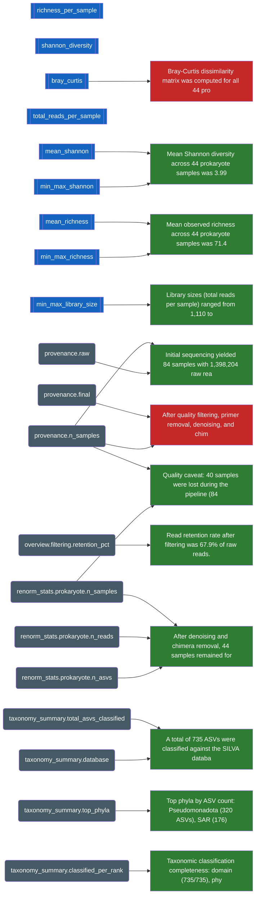

# Claim provenance DAG (qwen/qwen3.6-35b-a3b)

10/12 claims verified · 9 computations

Legend: 🟩 verified · 🟥 refuted · 🟨 unverifiable · 🟦 computation · ⬛ data

```mermaid
graph LR
  c1[["richness_per_sample"]]
  style c1 fill:#1565c0,color:#fff
  c2[["shannon_diversity"]]
  style c2 fill:#1565c0,color:#fff
  c3[["bray_curtis"]]
  style c3 fill:#1565c0,color:#fff
  c4[["total_reads_per_sample"]]
  style c4 fill:#1565c0,color:#fff
  c5[["mean_shannon"]]
  style c5 fill:#1565c0,color:#fff
  c6[["mean_richness"]]
  style c6 fill:#1565c0,color:#fff
  c7[["min_max_richness"]]
  style c7 fill:#1565c0,color:#fff
  c8[["min_max_shannon"]]
  style c8 fill:#1565c0,color:#fff
  c9[["min_max_library_size"]]
  style c9 fill:#1565c0,color:#fff
  k1["Initial sequencing yielded 84 samples with 1,398,204 raw rea"]
  style k1 fill:#2e7d32,color:#fff
  provenance.n_samples("provenance.n_samples")
  style provenance.n_samples fill:#455a64,color:#fff
  provenance.raw("provenance.raw")
  style provenance.raw fill:#455a64,color:#fff
  k2["After quality filtering, primer removal, denoising, and chim"]
  style k2 fill:#c62828,color:#fff
  provenance.final("provenance.final")
  style provenance.final fill:#455a64,color:#fff
  k3["Read retention rate after filtering was 67.9% of raw reads."]
  style k3 fill:#2e7d32,color:#fff
  overview.filtering.retention_pct("overview.filtering.retention_pct")
  style overview.filtering.retention_pct fill:#455a64,color:#fff
  k4["After denoising and chimera removal, 44 samples remained for"]
  style k4 fill:#2e7d32,color:#fff
  renorm_stats.prokaryote.n_samples("renorm_stats.prokaryote.n_samples")
  style renorm_stats.prokaryote.n_samples fill:#455a64,color:#fff
  renorm_stats.prokaryote.n_reads("renorm_stats.prokaryote.n_reads")
  style renorm_stats.prokaryote.n_reads fill:#455a64,color:#fff
  renorm_stats.prokaryote.n_asvs("renorm_stats.prokaryote.n_asvs")
  style renorm_stats.prokaryote.n_asvs fill:#455a64,color:#fff
  k5["Quality caveat: 40 samples were lost during the pipeline (84"]
  style k5 fill:#2e7d32,color:#fff
  k6["A total of 735 ASVs were classified against the SILVA databa"]
  style k6 fill:#2e7d32,color:#fff
  taxonomy_summary.total_asvs_classified("taxonomy_summary.total_asvs_classified")
  style taxonomy_summary.total_asvs_classified fill:#455a64,color:#fff
  taxonomy_summary.database("taxonomy_summary.database")
  style taxonomy_summary.database fill:#455a64,color:#fff
  k7["Top phyla by ASV count: Pseudomonadota (320 ASVs), SAR (176)"]
  style k7 fill:#2e7d32,color:#fff
  taxonomy_summary.top_phyla("taxonomy_summary.top_phyla")
  style taxonomy_summary.top_phyla fill:#455a64,color:#fff
  k8["Taxonomic classification completeness: domain (735/735), phy"]
  style k8 fill:#2e7d32,color:#fff
  taxonomy_summary.classified_per_rank("taxonomy_summary.classified_per_rank")
  style taxonomy_summary.classified_per_rank fill:#455a64,color:#fff
  k9["Mean Shannon diversity across 44 prokaryote samples was 3.99"]
  style k9 fill:#2e7d32,color:#fff
  k10["Mean observed richness across 44 prokaryote samples was 71.4"]
  style k10 fill:#2e7d32,color:#fff
  k11["Library sizes (total reads per sample) ranged from 1,110 to "]
  style k11 fill:#2e7d32,color:#fff
  k12["Bray-Curtis dissimilarity matrix was computed for all 44 pro"]
  style k12 fill:#c62828,color:#fff
  provenance.n_samples --> k1
  provenance.raw --> k1
  provenance.final --> k2
  provenance.n_samples --> k2
  overview.filtering.retention_pct --> k3
  renorm_stats.prokaryote.n_samples --> k4
  renorm_stats.prokaryote.n_reads --> k4
  renorm_stats.prokaryote.n_asvs --> k4
  provenance.n_samples --> k5
  renorm_stats.prokaryote.n_samples --> k5
  taxonomy_summary.total_asvs_classified --> k6
  taxonomy_summary.database --> k6
  taxonomy_summary.top_phyla --> k7
  taxonomy_summary.classified_per_rank --> k8
  c5 --> k9
  c8 --> k9
  c6 --> k10
  c7 --> k10
  c9 --> k11
  c3 --> k12
```
