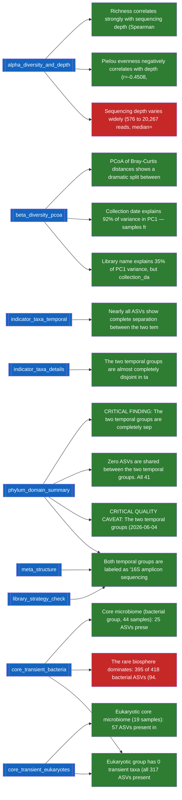

# Claim provenance DAG (qwen/qwen3.6-35b-a3b)

14/16 claims verified · 9 computations

Legend: 🟩 verified · 🟥 refuted · 🟨 unverifiable · 🟦 computation · ⬛ data

```mermaid
graph LR
  c1[["alpha_diversity_and_depth"]]
  style c1 fill:#1565c0,color:#fff
  c2[["beta_diversity_pcoa"]]
  style c2 fill:#1565c0,color:#fff
  c3[["indicator_taxa_temporal"]]
  style c3 fill:#1565c0,color:#fff
  c4[["indicator_taxa_details"]]
  style c4 fill:#1565c0,color:#fff
  c5[["phylum_domain_summary"]]
  style c5 fill:#1565c0,color:#fff
  c6[["meta_structure"]]
  style c6 fill:#1565c0,color:#fff
  c7[["library_strategy_check"]]
  style c7 fill:#1565c0,color:#fff
  c8[["core_transient_bacteria"]]
  style c8 fill:#1565c0,color:#fff
  c9[["core_transient_eukaryotes"]]
  style c9 fill:#1565c0,color:#fff
  k1["Richness correlates strongly with sequencing depth (Spearman"]
  style k1 fill:#2e7d32,color:#fff
  k2["Pielou evenness negatively correlates with depth (r=-0.4508,"]
  style k2 fill:#2e7d32,color:#fff
  k3["Sequencing depth varies widely (576 to 20,267 reads, median="]
  style k3 fill:#c62828,color:#fff
  k4["PCoA of Bray-Curtis distances shows a dramatic split between"]
  style k4 fill:#2e7d32,color:#fff
  k5["Collection date explains 92% of variance in PC1 — samples fr"]
  style k5 fill:#2e7d32,color:#fff
  k6["Library name explains 35% of PC1 variance, but collection_da"]
  style k6 fill:#2e7d32,color:#fff
  k7["Nearly all ASVs show complete separation between the two tem"]
  style k7 fill:#2e7d32,color:#fff
  k8["The two temporal groups are almost completely disjoint in ta"]
  style k8 fill:#2e7d32,color:#fff
  k9["CRITICAL FINDING: The two temporal groups are completely sep"]
  style k9 fill:#2e7d32,color:#fff
  k10["Zero ASVs are shared between the two temporal groups. All 41"]
  style k10 fill:#2e7d32,color:#fff
  k11["CRITICAL QUALITY CAVEAT: The two temporal groups (2026-06-04"]
  style k11 fill:#2e7d32,color:#fff
  k12["Both temporal groups are labeled as '16S amplicon sequencing"]
  style k12 fill:#2e7d32,color:#fff
  k13["Core microbiome (bacterial group, 44 samples): 25 ASVs prese"]
  style k13 fill:#2e7d32,color:#fff
  k14["The rare biosphere dominates: 395 of 418 bacterial ASVs (94."]
  style k14 fill:#c62828,color:#fff
  k15["Eukaryotic core microbiome (19 samples): 57 ASVs present in "]
  style k15 fill:#2e7d32,color:#fff
  k16["Eukaryotic group has 0 transient taxa (all 317 ASVs present "]
  style k16 fill:#2e7d32,color:#fff
  c1 --> k1
  c1 --> k2
  c1 --> k3
  c2 --> k4
  c2 --> k5
  c2 --> k6
  c3 --> k7
  c4 --> k8
  c5 --> k9
  c5 --> k10
  c5 --> k11
  c6 --> k12
  c7 --> k12
  c5 --> k12
  c8 --> k13
  c8 --> k14
  c9 --> k15
  c8 --> k16
  c9 --> k16
```
