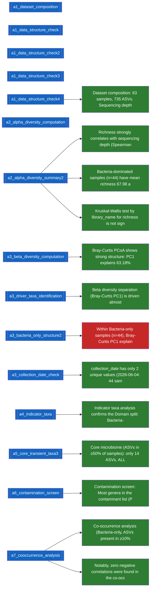

# Claim provenance DAG (qwen/qwen3.6-35b-a3b) — INCOMPLETE (6/11 investigations)

12/13 claims verified · 15 computations

Legend: 🟩 verified · 🟥 refuted · 🟨 unverifiable · 🟦 computation · ⬛ data

```mermaid
graph LR
  c1[["a1_dataset_composition"]]
  style c1 fill:#1565c0,color:#fff
  c2[["a1_data_structure_check"]]
  style c2 fill:#1565c0,color:#fff
  c3[["a1_data_structure_check2"]]
  style c3 fill:#1565c0,color:#fff
  c4[["a1_data_structure_check3"]]
  style c4 fill:#1565c0,color:#fff
  c5[["a1_data_structure_check4"]]
  style c5 fill:#1565c0,color:#fff
  c6[["a2_alpha_diversity_computation"]]
  style c6 fill:#1565c0,color:#fff
  c7[["a2_alpha_diversity_summary2"]]
  style c7 fill:#1565c0,color:#fff
  c8[["a3_beta_diversity_computation"]]
  style c8 fill:#1565c0,color:#fff
  c9[["a3_driver_taxa_identification"]]
  style c9 fill:#1565c0,color:#fff
  c10[["a3_bacteria_only_structure2"]]
  style c10 fill:#1565c0,color:#fff
  c11[["a3_collection_date_check"]]
  style c11 fill:#1565c0,color:#fff
  c12[["a4_indicator_taxa"]]
  style c12 fill:#1565c0,color:#fff
  c13[["a5_core_transient_taxa3"]]
  style c13 fill:#1565c0,color:#fff
  c14[["a6_contamination_screen"]]
  style c14 fill:#1565c0,color:#fff
  c15[["a7_cooccurrence_analysis"]]
  style c15 fill:#1565c0,color:#fff
  k1["Dataset composition: 63 samples, 735 ASVs. Sequencing depth "]
  style k1 fill:#2e7d32,color:#fff
  k2["Richness strongly correlates with sequencing depth (Spearman"]
  style k2 fill:#2e7d32,color:#fff
  k3["Bacteria-dominated samples (n=44) have mean richness 67.98 a"]
  style k3 fill:#2e7d32,color:#fff
  k4["Kruskal-Wallis test by library_name for richness is not sign"]
  style k4 fill:#2e7d32,color:#fff
  k5["Bray-Curtis PCoA shows strong structure: PC1 explains 63.18%"]
  style k5 fill:#2e7d32,color:#fff
  k6["Beta diversity separation (Bray-Curtis PC1) is driven almost"]
  style k6 fill:#2e7d32,color:#fff
  k7["Within Bacteria-only samples (n=44), Bray-Curtis PC1 explain"]
  style k7 fill:#c62828,color:#fff
  k8["collection_date has only 2 unique values (2026-06-04: 44 sam"]
  style k8 fill:#2e7d32,color:#fff
  k9["Indicator taxa analysis confirms the Domain split: Bacteria-"]
  style k9 fill:#2e7d32,color:#fff
  k10["Core microbiome (ASVs in ≥50% of samples): only 14 ASVs, ALL"]
  style k10 fill:#2e7d32,color:#fff
  k11["Contamination screen: Most genera in the contaminant list (P"]
  style k11 fill:#2e7d32,color:#fff
  k12["Co-occurrence analysis (Bacteria-only, ASVs present in ≥10% "]
  style k12 fill:#2e7d32,color:#fff
  k13["Notably, zero negative correlations were found in the co-occ"]
  style k13 fill:#2e7d32,color:#fff
  c5 --> k1
  c7 --> k2
  c7 --> k3
  c7 --> k4
  c8 --> k5
  c9 --> k6
  c10 --> k7
  c11 --> k8
  c12 --> k9
  c13 --> k10
  c14 --> k11
  c15 --> k12
  c15 --> k13
```
