# Claim provenance DAG (qwen/qwen3.5-35b-a3b) — INCOMPLETE (8/12 investigations)

3/9 claims verified · 15 computations

Legend: 🟢 replicated · 🟩 verified · 🟪 disputed · 🟧 partly supported · 🟥 refuted · 🟨 unverifiable · 🟦 computation · ⬛ data

```mermaid
graph LR
  a1{{"Alpha diversity metrics (observed ASVs, Shannon, Simpson, Pielou evenn"}}
  style a1 fill:#00695c,color:#fff
  a2{{"Dominance structure: what proportion of total reads are captured by th"}}
  style a2 fill:#00695c,color:#fff
  a3{{"Beta-diversity structure: do samples cluster by library_name (experime"}}
  style a3 fill:#00695c,color:#fff
  a4{{"Which taxa drive the primary axes of beta-diversity separation (if any"}}
  style a4 fill:#00695c,color:#fff
  a5{{"Prokaryote vs Eukaryote split: what is the relative abundance of Bacte"}}
  style a5 fill:#00695c,color:#fff
  a6{{"Core vs transient taxa: what proportion of ASVs are present in >50%, >"}}
  style a6 fill:#00695c,color:#fff
  a7{{"Contamination screen: what is the abundance of known kit/reagent gener"}}
  style a7 fill:#00695c,color:#fff
  a8{{"Differential abundance: which ASVs differ significantly between librar"}}
  style a8 fill:#00695c,color:#fff
  a9{{"Co-occurrence network: are there robust taxon-taxon associations after"}}
  style a9 fill:#00695c,color:#fff
  a10{{"Outlier detection: which samples have unusual diversity, composition, "}}
  style a10 fill:#00695c,color:#fff
  a11{{"What do the pre-computed x/y ordination coordinates (meta['x'], meta['"}}
  style a11 fill:#00695c,color:#fff
  a12{{"Which specific samples show the highest contaminant proportions, and d"}}
  style a12 fill:#00695c,color:#fff
  c1[["a1_alpha_diversity_and_depth"]]
  style c1 fill:#1565c0,color:#fff
  c2[["a1_depth_distribution_and_outliers"]]
  style c2 fill:#1565c0,color:#fff
  c3[["a2_dominance_structure"]]
  style c3 fill:#1565c0,color:#fff
  c4[["a3_beta_diversity_library_effect"]]
  style c4 fill:#1565c0,color:#fff
  c5[["a11_precomputed_ordination_analysis"]]
  style c5 fill:#1565c0,color:#fff
  c6[["a4_driver_taxa_beta_diversity"]]
  style c6 fill:#1565c0,color:#fff
  c7[["a4_driver_taxa_taxonomy_check"]]
  style c7 fill:#1565c0,color:#fff
  c8[["a5_prokaryote_eukaryote_split"]]
  style c8 fill:#1565c0,color:#fff
  c9[["a6_core_transient_taxa_prevalence_debug"]]
  style c9 fill:#1565c0,color:#fff
  c10[["a6_core_transient_taxa_debug2"]]
  style c10 fill:#1565c0,color:#fff
  c11[["a6_core_transient_taxa_prevalence_v4"]]
  style c11 fill:#1565c0,color:#fff
  c12[["a7_contamination_screen"]]
  style c12 fill:#1565c0,color:#fff
  c13[["a8_differential_abundance_depth_association_v2"]]
  style c13 fill:#1565c0,color:#fff
  c14[["a8_depth_associated_taxonomy"]]
  style c14 fill:#1565c0,color:#fff
  c15[["a8_depth_association_raw_pvals_v2"]]
  style c15 fill:#1565c0,color:#fff
  k1["Observed ASV richness shows strong positive correlation with"]
  style k1 fill:#ef6c00,color:#fff
  k2["Communities show strong dominance: top 10 ASVs capture ~76% "]
  style k2 fill:#1b5e20,color:#fff
  k3["Beta-diversity ordination shows PC1 explains 34% and PC2 exp"]
  style k3 fill:#2e7d32,color:#fff
  k4["Pre-computed ordination coordinates show unexpected patterns"]
  style k4 fill:#f9a825,color:#000
  k5["Beta-diversity ordination is driven by both abundant and rar"]
  style k5 fill:#4527a0,color:#fff
  k6["Dataset is eukaryote-dominated (74% mean proportion) with su"]
  style k6 fill:#2e7d32,color:#fff
  k7["Microbiome exhibits classic long-tail diversity: mean ASV pr"]
  style k7 fill:#ef6c00,color:#fff
  k8["Contamination screen identifies 24 ASVs matching known kit g"]
  style k8 fill:#ef6c00,color:#fff
  k9["Sequencing depth is a major driver of taxon detection: 641 o"]
  style k9 fill:#4527a0,color:#fff
  a3 --> a11
  a8 --> a12
  a1 --> k1
  c1 --> k1
  a2 --> k2
  c3 --> k2
  a3 --> k3
  c4 --> k3
  a4 --> k4
  c5 --> k4
  a5 --> k5
  c6 --> k5
  c7 --> k5
  a6 --> k6
  c8 --> k6
  a7 --> k7
  c11 --> k7
  a8 --> k8
  c12 --> k8
  a8 --> k9
  c13 --> k9
  c14 --> k9
  c15 --> k9
```

